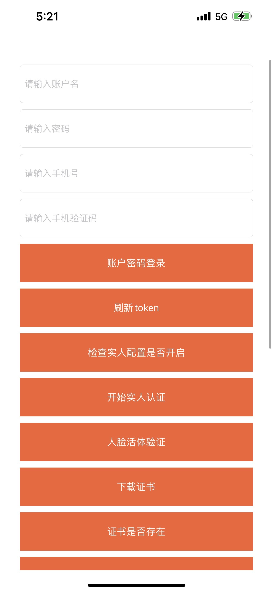
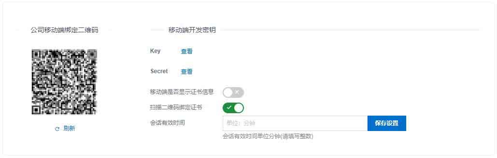

# IDaaS iOS SDK 集成文档

## 一.IDaaS iOS SDK介绍

IDASS 移动端SDK为用户提供一套接入IDaaS能力，让开发者快速集成。SDK提供以下能力

- [x] 账号密码登录
- [x] 证书登录
- [x] 短信登录
- [x] 扫码登录
- [x] OTP登录
- [x] 指纹认证
- [x] 实人认证
- [x] 手势认证

## 二.SDK DEMO 展示




## 三.使用前准备

> 前提：需要有部署IDaas的实例。

在【设置】【安全设置】【移动端绑定设置】菜单中获取移动端开发密钥



## 四.集成准备

#### 1. 导入需要的依赖库

- ```objective-c
  #import <NoPasswordSDK/NoPasswordLoginSDK.h>
  #import <NoPasswordSDK/CoreArchive.h>
  #import <NoPasswordSDK/CoreLockConst.h>
  #import <NoPasswordSDK/CLLockView.h>
  #import <NoPasswordSDK/CLLockLabel.h>
  ```
  
- 在`xcode->BuildSetting->Other Linker Flags` 添加 **-ObjC**
- 下载地址

     [NoPasswordSDK.framework](IDP_Demo/NoPasswordSDK.frameworkx) 

阿里实人SDK,这些需要从阿里实人官网申请下载，使用下载后对应的版本号。

- 需要在IDaaS配置 安全设置->实人认证
- 需要在IDaaS配置 安全设置->人脸识别

- 阿里云SDK下载地址：https://help.aliyun.com/document_detail/127692.html

#### 2. 初始化SDK信息


- ```objective-c
  /**
   * @brief 初始化接口.
   * @param IDPServerURL IDP4地址.
   * @param appKey 公司的appKey.
   * @param appSecret 公司的appSecret.
   * @param enterpriseId 公司的enterpriseId.
   */
  /**
 * @brief 初始化接口.
 * @param IDPServerURL IDP4地址.
 * @param appKey 公司的appKey.
 * @param appSecret 公司的appSecret.
 * @param enterpriseId 公司的enterpriseId.
 * @param aes256Key 公司的aes256Key.如果当前版本没有可以填空
 * @param ignoreCertificateVerify 是否忽略https 请求的服务器端证书验证
 */
- (id)initWithIDPServerURL:(NSString *)IDPServerURL appKey:(NSString *)appKey appSercert:(NSString *)appSecret enterpriseId:(NSString *)enterpriseId AES256Key:(NSString *)aes256Key ignoreCertificateVerify:(BOOL)ignoreCertificateVerify;
  ```

## 五.SDK调用

### 1. 账户密码登录

```objective-c

/**
 * @brief u+p登录IDP4
 * @param username 用户名.
 * @param password 密码.
 **/
- (void)loginWthUsername:(NSString *)username password:(NSString *)password success:(SuccessBlock)completionBlock failure:(FailureBlock)failureBlock;

 //成功示例
{		"success":true,
    "code":"200",
    "message":null,
    "requestId":"4645D1E3-B5E9-4635-A568-AEAF46793241",
    "data":{
        "accessTokenDto":{
            "errorDescription":null,
            "error":null,
            "errors":[

            ],
            "accessToken":"2f308def-cc27-49b4-b62a-93355cc470f9",
            "tokenType":"bearer",
            "refreshToken":"3ef89139-7884-4d44-908b-8728e825cccc",
            "scope":"read",
            "expiresIn":32528,
            "includeError":false
        },
        "secret": "inputYourCodeHere",
        "userInfo": {
            "username": "***",
            "userId": "***",
            "fullName": "***",
            "phone": null,
            "departmentName": null,
            "displayName": "***",
            "photo": null,
            "realNameFlag": false,
            "enableRealName": false
        },
        "serverTime":1588056647852,
        "admin":false,
        "authKeyDto":null,
        "needModifyPwd":false,
        "expiredReminder":true,
        "idToken":null
    }
}
```


### 2. 用户token刷新

```objective-c
/**
 * @brief 用户token刷新
 * @param refreshToken 登录返回的refreshToken.
 */
- (void)refreshTokenWithToken:(NSString *)refreshToken success:(SuccessBlock)completionBlock failure:(FailureBlock)failureBlock;
  //成功示例
{
    "success":true,
    "code":"200",
    "message":null,
    "requestId":null,
    "data":{
        "accessTokenDto":{
            "errorDescription":null,
            "error":null,
            "errors":[

            ],
            "accessToken":"e586902a-9885-45dd-8771-f1f230b3ce60",
            "tokenType":"bearer",
            "refreshToken":"05feb7ef-ff59-47fa-89ce-77c3654f6aaf",
            "scope":"read",
            "expiresIn":43199,
            "includeError":false
        }
    }
}
```

### 3. 查询实人认证是否开启

```objective-c
/**
* @brief 获取实人认证配置.
* @param access_token 登录成功后获取的accessToken值.
*/
-(void)aliyunGetConfigWithToken:(NSString *)access_token success:(SuccessBlock)completionBlock failure:(FailureBlock)failureBlock;

  //成功示例
{
    code = 200;
    data =     {
        archived = 0;
        authConfigJson = "<null>";
        createTime = "<null>";
        enabled = 0;
        enterpriseUuid = "<null>";
        uuid = "<null>";
        vendor = "<null>";
    };
    message = "<null>";
    requestId = "1643108888074$81fd79c7-06c8-2c7d-7592-e99c9b8237b5";
    success = 1;
}
```

### 4. 开始实人认证

```objective-c
/**
* @brief 检查是否实人.
* @param access_token 登录成功后获取的accessToken值.
*/
-(void)aliyunCheckUserRealPerson:(NSString *)access_token success:(SuccessBlock)completionBlock failure:(FailureBlock)failureBlock;
  //成功示例
{
    "success": true,
    "code": "200",
    "message": null,
    "requestId": null,
    "data": {
        "uuid": "23a34246c75879d76501ef89d88a0addd2dnsH4Q5H5",
        "createTime": "2020-10-16 12:04",
        "archived": false,
        "enterpriseUuid": "7c2cec4d2408d16e024db37542997ad8knZ65rWW2ZC",
        "udAccountUuid": "4ae77e1fdec58c9bbc5dfcec2e94c9fdt3v40U8kCmu",
        "username": "方***",
        "useVendorAuth": "ALI_CLOUD",
        "authResult": 200,
        "authResultInfo": "认证通过",
        "frontImgFileUuid": "c5ea1c5dd9710fe***f9b6d15gfyQjzRjeUL",
        "backImgFileUuid": "e1ea803c20946***585ewH2RAS00Hdh",
        "faceImgFileUuid": "91a474b53aff85***bd7612PNnJ2uKMcf2",
        "idCardNumber": "34***90",
        "sex": "Male",
        "nationality": "汉",
        "address": "安徽省***",
        "startDate": "20120809",
        "endDate": "20220809",
        "authority": "某某公安局"
    }
}
```

### 5. 人脸活体验证

```objective-c
/**
 * @brief step-3人脸活体认证开始,通过此接口获取阿里云SDK需要的verifyToken.
 * @param userId 用户的唯一标识,登录成功后获取.
 * @param access_token 登录成功后获取的accessToken值.
 */
-(void)aliyunStartFaceVertifyWithAccessToken:(NSString *)access_token userId:(NSString *)userId success:(SuccessBlock)completionBlock failure:(FailureBlock)failureBlock;
  
  //成功示例
{
    "success": true,
    "code": "200",
    "message": null,
    "requestId": "2211C865-4B8A-4904-B425-BB66F672F227",
    "data": {
        "bizId": "a6dcaa2a70a94bb0078d654a028e10bbX83EJb9ZTsH",
        "verifyToken": "d7202615824247b88c7de98b763ede25"
    }
}
```

### 6.下载证书

```objective-c

/**
 * @brief U+P下载证书.
 * @param username 用户名.
 * @param pwd 密码.
 **/
    [[NoPasswordLoginSDK shareInstance]DownLoadCertificateByPwdWithUsername:@"IDPSDKTest" pwd:@"Test@20199" success:^(NSDictionary *resultDic) {

        NSLog(@"成功 %@",resultDic);
    } failure:^(NSDictionary *errorDic) {

        NSLog(@"成功 %@",errorDic);
    }];
//成功示例
{
    code = 200;
    data =     {
    };
    message = "Download successful";
    requestId = "<null>";
    success = 1;
}
```

### 7. 证书是否存在

```objective-c
/**
 * @brief 判断证书是否存在.
 **/
+(BOOL)isExistCertificate;
```

### 8. 证书登录

```objective-c
/**
 * @brief 免密登录
 **/
-(void)VertifyId_tokenWithSuccess:(SuccessBlock )success failure:(FailureBlock )failure;
//成功示例
{
    "success":true,
    "code":"200",
    "message":null,
    "requestId":"4645D1E3-B5E9-4635-A568-AEAF46793241",
    "data":{
        "accessTokenDto":{
            "errorDescription":null,
            "error":null,
            "errors":[

            ],
            "accessToken":"2f308def-cc27-49b4-b62a-93355cc470f9",
            "tokenType":"bearer",
            "refreshToken":"3ef89139-7884-4d44-908b-8728e825cccc",
            "scope":"read",
            "expiresIn":32528,
            "includeError":false
        },
        "secret":"67N6ERJWFENFSAIP",
        "userInfo":{
            "username":"summer",
            "userId":"8990864823770637813",
            "fullName":"summer",
            "phone":null,
            "departmentName":null,
            "displayName":"summer",
            "photo":null,
            "realNameFlag":false,
            "enableRealName":false
        },
        "serverTime":1588056647852,
        "admin":false,
        "authKeyDto":null,
        "needModifyPwd":false,
        "expiredReminder":true,
        "idToken":null
    }
}
```

### 9. 获取短信验证码

```objective-c
/**
 * @brief 获取登录短信码
 * @param username 用户名.
 * @param phoneNumber 电话号码.
 **/
-(void)getSMSCodeWithUsername:(NSString *)username phoneNumber:(NSString *)phoneNumber success:(SuccessBlock )success failure:(FailureBlock )failure;
//成功示例
{
    code = 200;
    data =     {
        code = "xxxxx";
        phoneNumber = 139xxxxxxxx;
    };
    message = "<null>";
    requestId = "1643109269475$a4f3c588-b324-a887-5a8c-f7ab4701dee7";
    success = 1;
}
```

### 10. 短信验证码登录

```objective-c
/**
 * @brief 短信登录接口
 * @param username 用户名.
 * @param smsCode 短信码
 **/
-(void)loginWithUsername:(NSString *)username smsCode:(NSString *)smsCode success:(SuccessBlock )success failure:(FailureBlock )failure;
//成功示例
{
    "success": true,
    "code": "200",
    "message": null,
    "requestId": null,
    "data": {
        "uuid": "23a34246c75879d76501ef89d88a0addd2dnsH4Q5H5",
        "createTime": "2020-10-16 12:04",
        "archived": false,
        "enterpriseUuid": "7c2cec4d2408d16e024db37542997ad8knZ65rWW2ZC",
        "udAccountUuid": "4ae77e1fdec58c9bbc5dfcec2e94c9fdt3v40U8kCmu",
        "username": "方***",
        "useVendorAuth": "ALI_CLOUD",
        "authResult": 200,
        "authResultInfo": "认证通过",
        "frontImgFileUuid": "c5ea1c5dd9710fe***f9b6d15gfyQjzRjeUL",
        "backImgFileUuid": "e1ea803c20946***585ewH2RAS00Hdh",
        "faceImgFileUuid": "91a474b53aff85***bd7612PNnJ2uKMcf2",
        "idCardNumber": "34***90",
        "sex": "Male",
        "nationality": "汉",
        "address": "安徽省***",
        "startDate": "20120809",
        "endDate": "20220809",
        "authority": "某某公安局"
    }
}
```

### 11. 获取用户OTP码

```objective-c
/**
 * @brief 获取动态口令OTP Code.
 * @param secret 密钥.
 * @param digits 长度,一般6位.
 * @param period 更换时间间隔,一般30秒.
 **/
+(NSString *)getOtpCodeWithSecret:(NSString *)secret digits:(NSInteger )digits period:(NSTimeInterval )period;
```

### 12. 解密二维码内容

```objective-c
/**
 * @brief 解密二维码接口.
 * @param content 需要解密的二维码数据.
 **/
+(NSDictionary *)DecryptQRCodeiInformationWithContent:(NSString *)content;
```

### 13. 扫码登录IDP

```objective-c
/**
 * @brief 扫码登录IDP4.
 * @param verifyCode 解密二维码获取.
 * @param accessToken 登录返回的accesstoken.
 **/
-(void)sendCodeWithVerifyCode:(NSString *)verifyCode accessToken:(NSString *)accessToken success:(SuccessBlock )success failure:(FailureBlock )failure;
//成功示例
{
    "success": true,
    "code": "200",
    "message": "",
    "requestId": "B81429E0-5182-4961-B877-EE6296803778",
    "data": null
}
```

### 14. 获取已授权应用列表

```objective-c
/**
 * @brief 获取应用列表接口.
 * @param access_token 登录返回的accesstoken.
 */
-(void)getApplicationListWithAccessToken:(NSString *)access_token success:(SuccessBlock)completionBlock failure:(FailureBlock)failureBlock;
//成功示例
{
    code = 200;
    data =     {
        applicationList =         (
                        {
                androidAppId = "<null>";
                androidFacetId = "<null>";
                androidPackageName = "<null>";
                applicationId = "plugin_jxx";
                applicationUuid = dfcdeb6bxxxxxxxxx9acbcd2b46JEuy2TFvlIV;
                archived = 0;
                authorizedTime = 1629462278000;
                createTime = "2021-08-20 20:24";
                downloadAppUrl = "<null>";
                enabled = 1;
                internetFlag = 0;
                iosAppId = "<null>";
                iosFacetId = "<null>";
                logoUrl = "https://xxxxxxxx.com/public/image/e51e7a40d4932f73db5a8b86684a42cefGNsSU4obcU";
                logoUuid = e51e7a40d4932f73db5a8b86684a42cefGNsSU4obcU;
                name = "xxxx app";
                nativeApp = 0;
                oidcNativeApp = 0;
                specialFlag = 0;
                startUrl = "https://xxxxxxxx.com/enduser/mobile_sso_dfcdeb6bc1bbde292917759acbcd2b46JEuy2TFvlIV";
                startupClassName = "<null>";
                supportDeviceTypes =                 (
                    WEB
                );
                supportSSO = 1;
                uuid = 1f512d280f9c8fe9c0298d499981330fAMXyAjVdOrK;
                vpnFlag = 0;
            },
                        {
                androidAppId = "<null>";
                androidFacetId = "<null>";
                androidPackageName = "<null>";
                applicationId = "plugin_jwt";
                applicationUuid = d8e23bd4fd0e55de009c3a5e8338a1ecD31iUBL7BAg;
                archived = 0;
                authorizedTime = 1629443102000;
                createTime = "2021-08-20 15:05";
                downloadAppUrl = "<null>";
                enabled = 1;
                internetFlag = 0;
                iosAppId = "<null>";
                iosFacetId = "<null>";
                logoUrl = "https://xxxxxxxx.com/public/image/c2fc002f5cd575af35e921e223691d43CQFirOcnk2I";
                logoUuid = c2fc002f5cd575af35e921e223691d43CQFirOcnk2I;
                name = "iOS  adadad";
                nativeApp = 0;
                oidcNativeApp = 0;
                specialFlag = 0;
                startUrl = "https://xxxxxxxx.com/enduser/mobile_sso_d8e23bd4fd0e55de009c3a5e8338a1ecD31iUBL7BAg";
                startupClassName = "<null>";
                supportDeviceTypes =                 (
                    WEB
                );
                supportSSO = 1;
                uuid = 242ca07be4a30848833f5e8af5f966aa8IyaUMHXs8B;
                vpnFlag = 0;
            }
        );
    };
    message = "<null>";
    requestId = "1643110149815$820063ee-85ce-6c30-0505-e6120fc88fa1";
    success = 1;
}
```


### 15. 指纹登录

```objective-c
/**
 * @brief 指纹免密登录.iPhone X设备可使用FACEID,但是需要在info.plist配置权限
 **/
-(void)FingerprintLoginWithSuccess:(SuccessBlock )success failure:(FailureBlock )failure;
//成功示例
{
    "success":true,
    "code":"200",
    "message":null,
    "requestId":"4645D1E3-B5E9-4635-A568-AEAF46793241",
    "data":{
        "accessTokenDto":{
            "errorDescription":null,
            "error":null,
            "errors":[

            ],
            "accessToken":"2f308def-cc27-49b4-b62a-93355cc470f9",
            "tokenType":"bearer",
            "refreshToken":"3ef89139-7884-4d44-908b-8728e825cccc",
            "scope":"read",
            "expiresIn":32528,
            "includeError":false
        },
        "secret":"67N6ERJWFENFSAIP",
        "userInfo":{
            "username":"summer",
            "userId":"8990864823770637813",
            "fullName":"summer",
            "phone":null,
            "departmentName":null,
            "displayName":"summer",
            "photo":null,
            "realNameFlag":false,
            "enableRealName":false
        },
        "serverTime":1588056647852,
        "admin":false,
        "authKeyDto":null,
        "needModifyPwd":false,
        "expiredReminder":true,
        "idToken":null
    }
}
```

### 16. 手势认证

```objective-c
 GestureUnlockViewController *gesture = [[UIStoryboard storyboardWithName:@"Main" bundle:nil] instantiateViewControllerWithIdentifier:@"GestureUnlock"];
    gesture.modalPresentationStyle = UIModalPresentationFullScreen;
    [self.navigationController pushViewController:gesture animated:YES];
```
~~~

